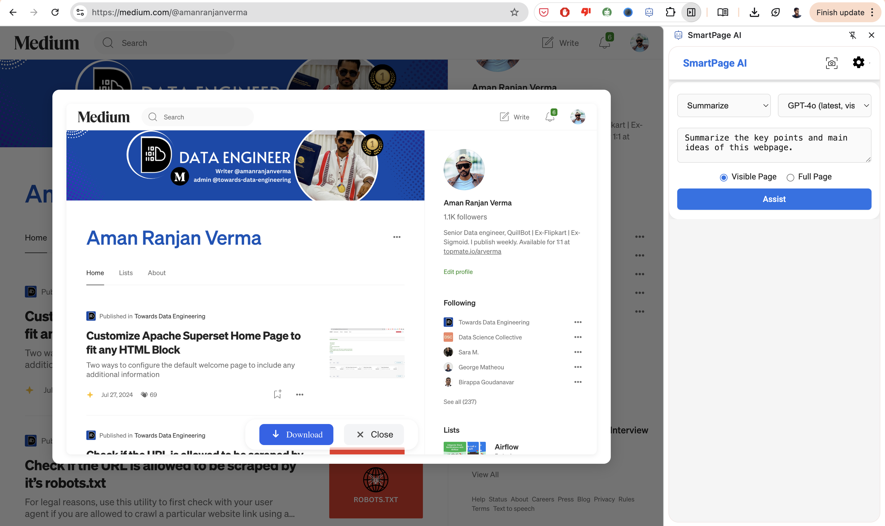
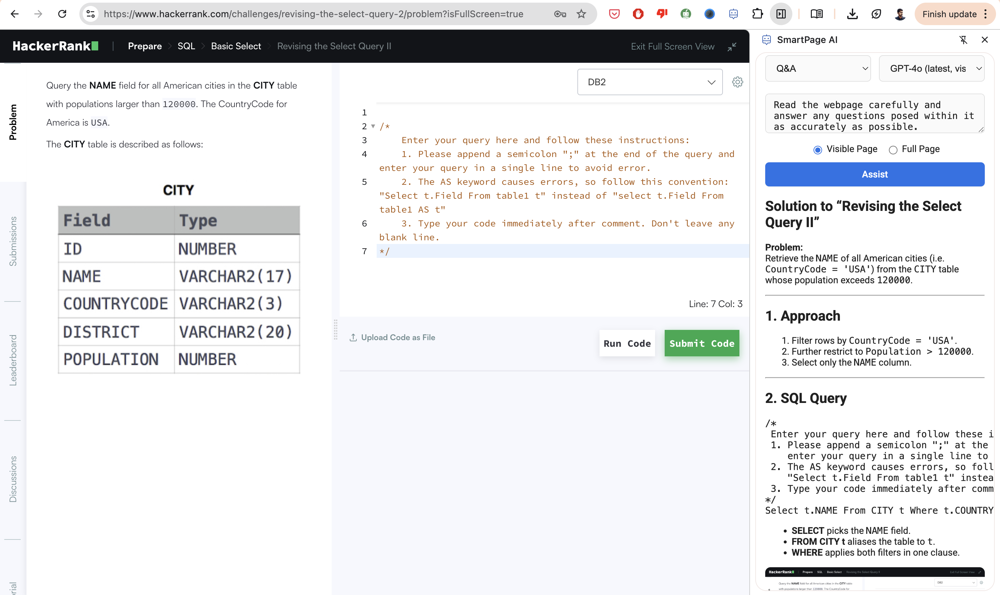
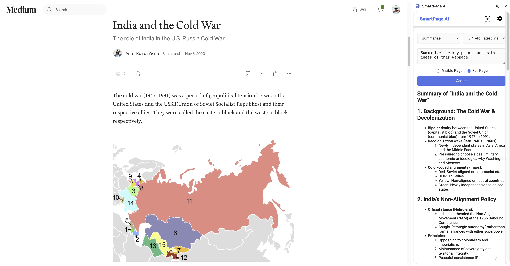

# 📖 SmartPage AI (Chrome Extension)

SmartPage AI is a modern Chrome extension that lets you summarize, translate, Q&A, and **analyze** any webpage or **screenshot** using OpenAI's GPT models—with beautiful Markdown output and a polished, minimal UI.

---

## ✨ Features

- 📸 **Full Page & Visible Page Screenshot Assist**
  - Capture the entire page or just the visible area for AI-powered analysis.
    
- 🧠 **Essential Prompt Options**
  - Summarize, Q&A, Translate, Explain, Improve Writing, or write your own prompt.
    
    
- 🤖 **Model Selector**
  - Choose from all supported OpenAI GPT models (including vision models).
- 🖼️ **Beautiful Markdown Rendering**
  - All AI responses are rendered as Markdown for clear, readable output.
- 🛡️ **Robust Error Handling**
  - User-friendly error messages, loading spinners, and no cluttered logs.
- 🧩 **Modern, Minimal UI**
  - Material-inspired, responsive, and accessible design.
- 🛠️ **Easy Extensibility**
  - Centralized constants for prompts/models, clean code, and ready for open source.

---

## 🚀 Getting Started

1. **Clone or Download** this repo.
2. **Add your OpenAI API key** in the extension settings panel.
3. **Choose a prompt** or write your own.
4. **Select screenshot mode** (Visible or Full Page).
5. **Click Assist**—the extension captures the page and summarizes, translates, or answers questions!

---

## 🛡️ Privacy

- Your API key and prompts are stored **only on your local browser** using `chrome.storage.sync`.
- No data is transmitted externally except to OpenAI's API when you trigger an action.

---

## 🛠️ Developer Notes

- **Centralized config:** Prompts and models are defined in `src/constants/` and imported everywhere.
- **No debug logs:** All unnecessary logging is removed for production.
- **Easy to extend:** Add new prompts or models in one place.

---

## 📄 License

MIT
